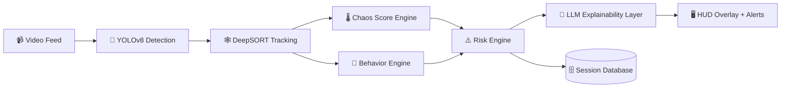

<div align="center">

# 🚦 RoadSense AI
### *The AI Co-Pilot Built for the Beautiful Chaos of Indian Roads*

**Real-time. Explainable. Unapologetically Indian traffic-aware.**


*Most ADAS systems were trained on empty German autobahns.*
*RoadSense AI was trained for auto-rickshaws cutting lanes at 40kph.*

</div>

---

## 🎬 The Problem, In One Line

> Western ADAS assumes lane discipline. **Indian roads laugh at lane discipline.**

RoadSense AI doesn't fight the chaos — it *understands* it. It watches the road the way an experienced Indian driver does: constantly recalculating risk from a swirl of bikes, autos, buses, pedestrians, and the occasional cow-shaped surprise.

---

## 🗺️ Table of Contents

| | | |
|---|---|---|
| [⚡ Key Features](#-key-features) | [🧠 How It Thinks](#-how-it-thinks) | [🛠️ Tech Stack](#️-tech-stack) |
| [📂 Project Structure](#-project-structure) | [🚀 Quick Start](#-quick-start-local-development) | [🐳 Docker Deployment](#-docker-deployment) |
| [📊 Session Analytics](#-database--historical-session-analytics) | [🎯 Roadmap](#-roadmap) | |

---

## ⚡ Key Features

<table>
<tr><td width="70">🎯</td><td><b>Real-Time Object Detection (YOLOv8)</b><br/>Spots cars, motorcycles, auto-rickshaws, buses, trucks, and pedestrians — in scenes that would make a Western dataset cry.</td></tr>
<tr><td>🕸️</td><td><b>Multi-Object Tracking (DeepSORT)</b><br/>Follows every road user frame-to-frame, building trajectory history and estimating velocity, speed, and heading — so the system remembers, not just sees.</td></tr>
<tr><td>🔮</td><td><b>Behavioral Intent Prediction</b><br/>Heuristic rules flag aggressive lane-cutting, sudden overtakes, blind-spot intrusions, and pedestrian crossings <i>before</i> they become incidents.</td></tr>
<tr><td>🌡️</td><td><b>Traffic Chaos Score™</b><br/>A live <code>0–100</code> dial measuring density, speed variance, and lane violations — the system's "how wild is this intersection right now" gauge.</td></tr>
<tr><td>💬</td><td><b>Explainable AI Warnings</b><br/>No cryptic beeps. Just plain language: <i>"Motorcycle approaching rapidly from left blind spot."</i> Drivers trust what they understand.</td></tr>
</table>

---

## 🧠 How It Thinks



Every frame runs this full loop — detect, track, score, explain — in near real time.

---

## 🛠️ Tech Stack

| Layer | Weapon of Choice |
|---|---|
| 🎯 Object Detection | **YOLOv8** |
| 🕸️ Object Tracking | **DeepSORT** |
| ⚙️ Backend API | **FastAPI** & **Uvicorn** |
| 🖼️ Image Processing | **OpenCV** & **NumPy** |
| 🗣️ AI Explanations | **Groq LLaMA3 API** (with rule-based fallback) |

---

## 📂 Project Structure

<details>
<summary><b>Click to expand the full directory map 🗂️</b></summary>

```
ADAS Adoption/
│
├── backend/
│   ├── main.py                  # FastAPI Application Entrypoint
│   ├── config.py                # Configuration & Thresholds
│   │
│   ├── detectors/
│   │   └── yolo_detector.py     # YOLOv8 Detection Wrapper
│   │
│   ├── trackers/
│   │   └── deepsort_tracker.py  # DeepSORT Tracking Wrapper
│   │
│   ├── analytics/
│   │   ├── chaos_score.py       # Traffic Chaos Estimation Engine
│   │   ├── behavior_engine.py   # Lateral/Speed Behavior Engine
│   │   └── risk_engine.py       # Multi-Factor Proximity/Lane Risk Engine
│   │
│   ├── explainability/
│   │   └── llm_alerts.py        # Natural Language Warn & Action Generator
│   │
│   ├── services/
│   │   ├── video_processor.py   # Core processing pipeline orchestrator
│   │   └── video_writer.py      # Video export utility
│   │
│   └── utils/
│       ├── drawing.py           # OpenCV Annotation & HUD Overlay drawing
│       └── geometry.py          # Math & Vector utilities
│
├── vedio/                       # Input video folder (ignored in git)
└── requirements.txt             # Python Dependencies
```

</details>

---

## 🚀 Quick Start (Local Development)

### 1️⃣ Install Dependencies
```bash
cd backend
python install.py
```

### 2️⃣ Configure Environment Variables
Create a `.env` file in the root directory (and/or in `backend/`):
```env
GROQ_API_KEY=your_groq_api_key_here
DATABASE_URL=sqlite+aiosqlite:///./roadsense.db
```

### 3️⃣ Fire Up the Backend

<table>
<tr><th>🪟 Windows</th><th>🐧 Linux / 🍎 macOS</th></tr>
<tr>
<td>

```bash
backend\start_server.bat
```
or
```bash
cd backend
python -m uvicorn main:app --host 0.0.0.0 --port 8000
```
</td>
<td>

```bash
cd backend
chmod +x start_server.sh
./start_server.sh
```
</td>
</tr>
</table>

Then open **`http://localhost:8000`** and watch the chaos score come alive. 🌡️

---

## 🐳 Docker Deployment

Fully containerized. Optional NVIDIA GPU pass-through for when you want the real speed.

### Prerequisites
- ✅ [Docker](https://www.docker.com/) + [Docker Compose](https://docs.docker.com/compose/)
- ⚡ *(Optional, for GPU)* [NVIDIA Container Toolkit](https://docs.nvidia.com/datacenter/cloud-native/container-toolkit/latest/install-guide.html)

### Launch the Stack
```bash
docker compose up --build -d
```

This one command:
- 🏗️ Compiles the multi-stage, production-grade image
- 🚀 Starts FastAPI + Uvicorn
- 💾 Mounts `./data/videos` and `./data/db` for persistent uploads & sessions

### GPU vs CPU

| Mode | What Happens |
|---|---|
| 🎮 **GPU (default)** | Allocates 1 NVIDIA GPU via `deploy:` block in `docker-compose.yml` |
| 💻 **CPU (fallback)** | Remove/comment the `deploy:` block → auto-downscales to `320px` for speed |

---

## 📊 Database & Historical Session Analytics

Every run leaves a trail. RoadSense AI persists full session telemetry to SQLite/PostgreSQL — nothing vanishes when the video ends.

**What gets tracked per session:**
- 🆔 A unique `VideoSession` record
- 📈 Frame-by-frame chaos scores & vehicle densities
- 🔔 Full warning/alert telemetry

### 🕹️ Using the Session History Panel

1. Open the dashboard → `http://localhost:8000`
2. Click **📊 History** (top-right toolbar)
3. Browse the slide-over panel → Total Sessions, Average Chaos, Total Alerts
4. Click into any session for:
   - 📋 Detailed metadata summary
   - 📉 Interactive canvas-rendered **Traffic Chaos Timeline**
   - ⚠️ Complete list of every triggered ADAS alert
5. 🗑️ Delete any session with one click

---

## 🎯 Roadmap

- [ ] Live camera stream ingestion (not just uploaded video)
- [ ] Mobile HUD companion app
- [ ] Expanded VRU (vulnerable road user) classification
- [ ] Multi-camera intersection fusion

---

<div align="center">

### 🛣️ Built for the roads that break every rulebook.

**RoadSense AI doesn't just detect traffic — it understands it.**

</div>
