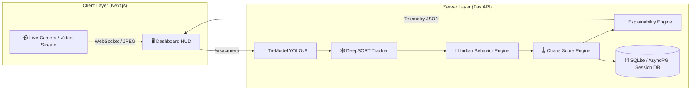

<div align="center">

# 🚦 RoadSense AI
### *The AI Driver Assistance & Traffic Intelligence Platform Built for Unstructured Roads*

**Real-Time Detection · DeepSORT Tracking · Traffic Chaos Dial™ · Live Camera Streaming**

[](https://adas-frontend.onrender.com/)
[](https://adas-frontend.onrender.com/)
[](LICENSE)

<br/>

> 🌐 **Live Production App:** [https://adas-frontend.onrender.com/](https://adas-frontend.onrender.com/)

*Most ADAS systems were trained on orderly, lane-marked highways.*  
*RoadSense AI was engineered for dense urban intersections, auto-rickshaws, fast-moving two-wheelers, and unpredictable pedestrian traffic.*

</div>

---

## 🚀 Live Demo & Deployment

| Component | Hosted URL | Infrastructure |
|---|---|---|
| 📱 **Frontend App** | [https://adas-frontend.onrender.com/](https://adas-frontend.onrender.com/) | Next.js Standalone Container (Render) |
| ⚡ **Backend API** | `https://adas-backend-u3k8.onrender.com` | FastAPI + CPU PyTorch + YOLOv8 |

---

## ⚡ Key Features

<table>
<tr><td width="70">🎯</td><td><b>Tri-Model YOLOv8 Object Detection</b><br/>Recognizes cars, motorcycles, auto-rickshaws, buses, trucks, and pedestrians with custom Indian vehicle class mapping and low-latency CPU optimization.</td></tr>
<tr><td>🕸️</td><td><b>DeepSORT Multi-Object Tracking</b><br/>Assigns persistent IDs frame-to-frame, estimating real-time trajectory history, speed vectors, and heading direction across occlusion gaps.</td></tr>
<tr><td>📷</td><td><b>Low-Latency Live Camera Streaming</b><br/>Stream mobile phone rear cameras or webcams directly over WebSockets (`/ws/camera`) with real-time detection overlay rendering.</td></tr>
<tr><td>🌡️</td><td><b>Traffic Chaos Score™ (0–100)</b><br/>Real-time dynamic index measuring road user density, speed variance, proximity risks, and spatial entropy.</td></tr>
<tr><td>💬</td><td><b>Explainable ADAS Alerts</b><br/>Generates plain-language driver alerts (e.g., <i>"Auto-rickshaw cutting into blind spot from left"</i>) backed by Groq LLaMA3 / rule-based fallback.</td></tr>
<tr><td>📊</td><td><b>Session History & Analytics</b><br/>Persists full frame-by-frame telemetry, alert logs, and chaos timelines in SQLite/AsyncSession for historical review and export.</td></tr>
</table>

---

## 🧠 System Architecture


```mermaid
flowchart LR
    subgraph Frontend ["Client Layer (Next.js)"]
        A[📹 Live Camera / Video Stream] -->|WebSocket / JPEG| B[🖥️ Dashboard HUD]
    end

    subgraph Backend ["Server Layer (FastAPI)"]
        B -->|/ws/camera| C[🎯 Tri-Model YOLOv8]
        C --> D[🕸️ DeepSORT Tracker]
        D --> E[🔮 Indian Behavior Engine]
        E --> F[🌡️ Chaos Score Engine]
        F --> G[💬 Explainability Engine]
        G -->|Telemetry JSON| B
        F --> H[(🗄️ SQLite / AsyncPG Session DB)]
    end
```

---

## 🛠️ Tech Stack

| Layer | Technology |
|---|---|
| 🖥️ **Frontend** | **Next.js 16** (App Router, Turbopack), **TypeScript**, **Tailwind CSS**, **Framer Motion**, **Lucide Icons** |
| ⚡ **Backend** | **FastAPI**, **Uvicorn**, **Python 3.11** |
| 🎯 **Computer Vision** | **YOLOv8** (PyTorch CPU-optimized), **OpenCV**, **NumPy** |
| 🕸️ **Tracking** | **DeepSORT Realtime** (Kalman Filter + Hungarian Algorithm) |
| 🗄️ **Database** | **SQLAlchemy 2.0** + **aiosqlite** / **PostgreSQL** |
| ☁️ **Deployment & CI/CD** | **Render**, **Docker**, **GitHub Actions** |

---

## 📂 Project Structure

```
ADAS Adoption/
├── frontend/                     # Next.js 16 Standalone Dashboard App
│   ├── src/
│   │   ├── app/                  # App Router pages & API routes
│   │   ├── components/dashboard/ # VideoStream, ChaosGauge, Sessions, Telemetry HUD
│   │   └── lib/                  # API client, WebSocket URL resolvers, Types
│   └── Dockerfile                # Standalone Next.js production build
│
├── backend/                      # FastAPI Python ADAS Engine
│   ├── main.py                   # FastAPI WebSocket & REST endpoints
│   ├── config.py                 # Central configuration, model paths & memory controls
│   ├── detectors/
│   │   └── yolo_detector.py      # Tri-Model YOLOv8 detector with single-pass CPU fallback
│   ├── trackers/
│   │   └── deepsort_tracker.py   # DeepSORT tracker with confidence caching & label smoothing
│   ├── analytics/
│   │   ├── behavior_engine.py    # Behavior classification & static structure filtering
│   │   ├── chaos_score.py        # Chaos Score 0-100 algorithm
│   │   └── risk_engine.py        # Proximity & speed risk assessor
│   ├── services/
│   │   ├── video_processor.py    # Pipeline orchestrator
│   │   └── video_writer.py       # Frame buffering & MP4 exporter
│   └── Dockerfile                # CPU-optimized PyTorch container
│
├── render.yaml                   # Render Blueprint multi-service deployment spec
├── docker-compose.yml            # Local Docker stack orchestration
└── requirements.txt              # Core Python dependencies
```

---

## 🚀 Quick Start (Local Development)

### 1️⃣ Clone & Setup Backend

```bash
# Activate virtual environment
python -m venv venv
source venv/bin/activate  # On Windows: .\venv\Scripts\activate

# Install CPU-optimized dependencies
pip install torch torchvision --index-url https://download.pytorch.org/whl/cpu
pip install -r requirements.txt

# Start backend server
cd backend
python -m uvicorn main:app --host 0.0.0.0 --port 8000 --reload
```

### 2️⃣ Setup Frontend

```bash
cd frontend
npm install
npm run dev
```

Visit **`http://localhost:3000`** in your browser.

---

## 🐳 Docker Deployment

Run both Frontend and Backend together with single-command Docker Compose:

```bash
docker compose up --build -d
```

- **Frontend:** `http://localhost:3000`
- **Backend API:** `http://localhost:8000`

---

<div align="center">

### 🛣️ Built for the roads that break every rulebook.

**[Launch Live Demo](https://adas-frontend.onrender.com/)**

</div>
